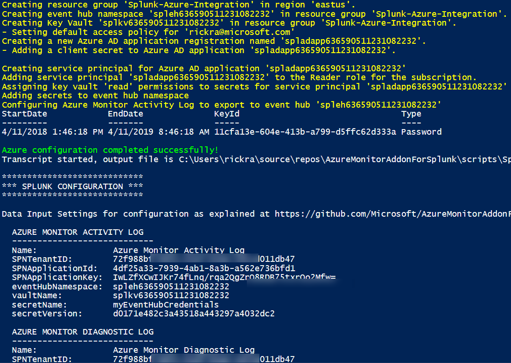
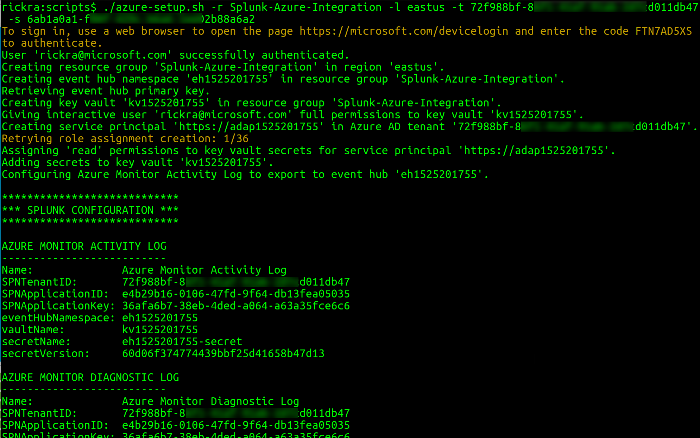
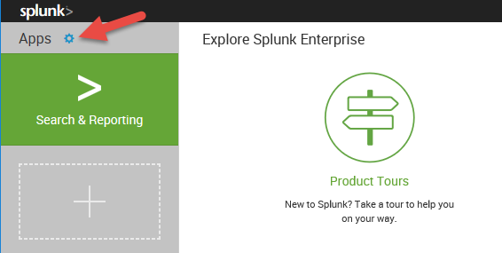
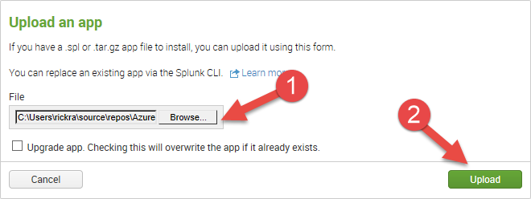
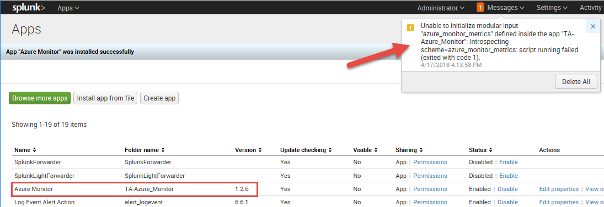
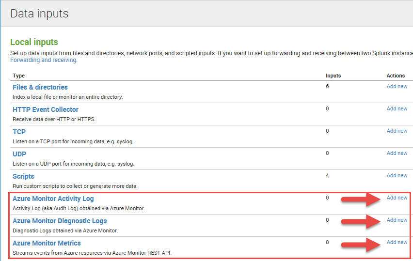
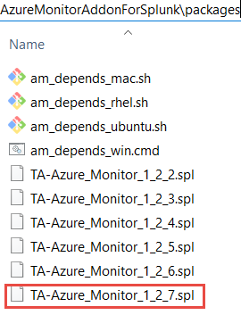

# Azure Monitor Add-on for Splunk

## NOTES

This Splunk TA (add-on) is Open Source. Support is best effort. Members of the community (you) are encouraged to participate so that this popular TA can get the support its users richly deserve.

Please log your feature requests as issues.

If you prefer to stream your Azure Monitor telemetry to Splunk's HEC port, please check out this alternative to installing an add-on on your Splunk box:  

[Azure Function for Splunk](https://github.com/Microsoft/AzureFunctionforSplunkVS)

## Overview  

This add-on is built using Node.js and Python 2.7 and has been tested on Ubuntu 14.04, Windows 10 and RHEL 7.

It consumes Metrics, Resource Diagnostic Logs, and Tenant Diagnostic Logs (AAD Activity Log) and the Azure Activity Log according to the techniques defined by Azure Monitor, which provides highly granular and real-time monitoring data for Azure resources, and passes those selected by the user's configuration along to Splunk.

Here are a few resources if you want to learn more about Azure Monitor:<br/>
* [Overview of Azure Monitor](https://docs.microsoft.com/en-us/azure/monitoring-and-diagnostics/monitoring-overview)
* [Overview of Azure Diagnostic Logs](https://docs.microsoft.com/en-us/azure/monitoring-and-diagnostics/monitoring-overview-of-diagnostic-logs)
* [Overview of the Azure Activity Log](https://docs.microsoft.com/en-us/azure/monitoring-and-diagnostics/monitoring-overview-activity-logs)
* [Overview of Azure Active Directory Activity Logs](https://docs.microsoft.com/en-us/azure/active-directory/reports-monitoring/concept-activity-logs-in-azure-monitor), known in Azure Monitor as Tenant Diagnostic Logs.
* [Overview of Metrics in Microsoft Azure](https://docs.microsoft.com/en-us/azure/monitoring-and-diagnostics/monitoring-overview-metrics)
* [Stream Azure monitoring data to an event hub for consumption by an external tool](https://docs.microsoft.com/en-us/azure/monitoring-and-diagnostics/monitor-stream-monitoring-data-event-hubs)

## Installation and Configuration

This add-on requires an Azure Event Hub, Key Vault, Azure AD Service Principal and other configurations to properly integrate Splunk with Azure.  Creating and configuring the Azure resources can be accomplished using one of the scripts available in the `.\scripts` folder as shown here:

### MSI authentication

If you are planning to use MSI authentication instead of Service Principal (SPN), first ensure that you VM is up and running within your Azure subscription.


* Windows users can use the PowerShell script `.\scripts\azure-setup.ps1`.  Proceed to the section [Azure configuration for Windows users](#powershell).  
* Linux and Mac users can use the Bash script `.\scripts\azure-setup.sh`. Proceed to the section [Azure configuration for Linux / Mac users](#bash).

### <a name="powershell"></a>Azure configuration for Windows users ###

#### Requirements ####

* Azure PowerShell, which you can download from [here](https://www.microsoft.com/web/handlers/webpi.ashx/getinstaller/WindowsAzurePowershellGet.3f.3f.3fnew.appids).  The script was tested with version 5.7.0 of the Azure PowerShell cmdlets running on Windows Server 2016.
* The following resource providers must be registered in your Azure subscription.  You can find out which resouce providers are registered in your subscription using the command `Get-AzureRmResourceProvider | Where-Object { $_.RegistrationState -eq "Registered" } | Select ProviderNamespace`.
  * Microsoft.Authorization
  * Microsoft.EventHub
  * Microsoft.KeyVault
  * Microsoft.Storage
  * microsoft.insights

#### Configuration Steps ####

1. Open `.\scripts\azure-setup.ps1`.  Replace the variables at the top of the script with values from your environment.
   * `$subscriptionId` : Your Azure subscription Id.
   * `$tenantId` : The tenant / directory Id for your Azure subscription.
   * `$splunkResourceGroupName` : The name of the resource group to deploy the cluster into.  This can be a new or existing resource group.
   * `$splunkResourceGroupLocation` : The location you want to deploy the cluster in.  For example, _eastus_, _westus_, etc.

   An example showing the variables populated is shown here:
   
2. Run the script.  The script will prompt you to authenticate to your Azure subscription.  The output for the script will look similar to the output shown here:
   

   Proceed to the section [Splunk Enterprise configuration](#splunk-setup).

### <a name="bash"></a>Azure configuration for Linux / Mac users ###

#### Requirements ####

* Azure command-line interface (CLI), which you can download from [here](https://docs.microsoft.com/en-us/cli/azure/install-azure-cli).  The script was tested with version 2.0.42 of the Azure CLI running on Ubuntu 18.04 LTS.
* The following resource providers must be registered in your Azure subscription.  You can find out which resouce providers are registered in your subscription using the command ``az provider list --query '[?registrationState==`Registered`].namespace'``.
  * Microsoft.Authorization
  * Microsoft.EventHub
  * Microsoft.KeyVault
  * Microsoft.Storage
  * microsoft.insights

#### Configuration Steps ####

1. Open a terminal window and navigate to the `.\scripts` folder.  The bash script requires four parameters as shown here:

   ``` bash
   usage:  azure-setup.sh [options]
   options:
     -l <location>            : [Required] Location to provision resources in. Ex. westus, eastus, etc.
     -r <resource group name> : [Required] Resource group to deploy resources into.
     -s <subscription id>     : [Required] Azure subscription Id.
     -t <tenant id>           : [Required] Azure Active Directory / Tenant Id.
     -m <vm name>             : [Optional] VM name of VM that has MSI enabled. This will skip SPN setup and assign RBAC access for the VM.
   ```

2. Run the script.  The script will prompt you to authenticate to your Azure subscription.  The output for the script will look similar to the output shown here:
   

   Proceed to the section [Splunk Enterprise configuration](#splunk-setup).

### <a name="splunk-setup"></a>Splunk Enterprise configuration ###

1. Install the add-on in Splunk Enterprise using the latest package file in `.\packages\*.spl`.
   * In Splunk, open the apps manager page by clicking on the gear icon.

      

   * Click on the button labeled **Install app from file**.

   * In the dialog window, click the **Browse...** button and select the latest `*.spl` file in the `.\packages` folder.  Next, click the **Upload** button.

      

   * After uploading the add-on app, the apps manager page should show the application installed in Splunk.  An error message may also appear if the indicating the add-on could not initialize.  This is typically because dependencies for Python and/or Node.js are not present.

      

   * To resolve the error message stating Splunk is "Unable to initialize modular input", install Node.js and Python on your Splunk Enterprise instance as described [here](https://github.com/Microsoft/AzureMonitorAddonForSplunk/wiki/Installation).  An example for an instance running on Ubuntu is shown below:
      * Run the following commands to install the Python and Node.js dependencies:

         ```bash
         # Elevate to root user
         sudo -i

         # Download script to setup Python dependencies
         curl -O https://raw.githubusercontent.com/Microsoft/AzureMonitorAddonForSplunk/master/packages/am_depends_ubuntu.sh

         # Set the execution attribute on the downloaded script
         chmod +x ./am_depends_ubuntu.sh

         # Run the script
         ./am_depends_ubuntu.sh

         # Download Node.js and it's dependencies
         curl -sL https://deb.nodesource.com/setup_6.x | sudo -E bash -

         # Install Node.js
         apt-get install nodejs

         # Install Nodel modules in the add-on's app folder.
         cd /opt/splunk/etc/apps/TA-Azure_Monitor/bin/app
         npm install

         # Return back to a non-root user
         exit
         ```

      * Go back to Splunk and click the **Disable** link for the add-on.

        

      * Click the **Enable** link to re-enable the add-on.  The add-on should be enabled now without any error messages appearing.

2. Using the output from either the `.\scripts\azure-setup.ps1` or `.\scripts\azure-setup.sh` above, configure the add-on's data inputs.

   * In Splunk, click on **Settings** -> **Data Inputs** at the top of the page.

   * For each of the add-on's data inputs, add a new configuration by copying and pasting the settings from the script's output into the data input's configuration.

      

# Support

If you have encountered difficulties with the add-on, the first thing to do is ensure that all Python and Nodejs dependencies are installed correctly according to the installation instructions in the wiki.

The Activity Log and Diagnostic Log data inputs use AMQP to connect to event hub over TLS using ports 5671 / 5672 as described in the [AMQP 1.0 Service Bus and Event Hubs protocol guide](https://docs.microsoft.com/en-us/azure/service-bus-messaging/service-bus-amqp-protocol-guide).  So, if you are having connection/authentication issues, check that these ports are open on your Splunk instance.

The Azure Monitor Metrics data input uses HTTPS to call into the Azure Monitor Metric API.  As such, outbound traffic over port 443 needs to be enabled on the server.

If that doesn't help, the next thing to do is switch logging for ExecProcessor to Debug (Settings / Server Settings / Server Logging in Splunk Web) and recycle the add-on (disable/enable). Then search for 'azure_monitor' ERROR and DEBUG messages. There will be a lot of DEBUG messages. If you don't see anything helpful, open an issue in the repo.

# Contributing

This project has adopted the [Microsoft Open Source Code of Conduct](https://opensource.microsoft.com/codeofconduct/). For more information see the [Code of Conduct FAQ](https://opensource.microsoft.com/codeofconduct/faq/) or contact [opencode@microsoft.com](mailto:opencode@microsoft.com) with any additional questions or comments.

## Generating the Splunk package file

As a contributor, you will need to generate a version specific package file that includes your changes, such as `.\packages\TA-Azure_Monitor_1_2_7.spl`.  Follow the steps below to generate the version specific package file.

Note: The scripts use [7-Zip](https://www.7-zip.org/) to build the the file structure and contents.  So, make sure you have this installed on your computer and that `7z` can be run from a command/shell prompt. 

1. Open `.\default\app.conf` and bump the **version** property in the **[launcher]** section.

2. This step generates the version specific package file.  If you are running Windows, then you will use the `.\deployment\package.cmd` script.  If you are running Mac or Linux, use the `.\deployment\package.sh` script.  Open a command/shell prompt and change to the `.\deployment` directory.  Execute the script, passing in the version specific string as shown below.  Notice the use of underscores in the string.

   **Windows**
   ```
   package.cmd 1_2_7
   ```

   **Mac or Linux**
   ```
   ./package.sh 1_2_7
   ```

   The version specific package file will be in the `.\packages` folder, as shown below.

   

3. The version specific package file should be committed to the repository with your code changes.  It is tradition to remove the oldest version specific package file when creating a new one.
